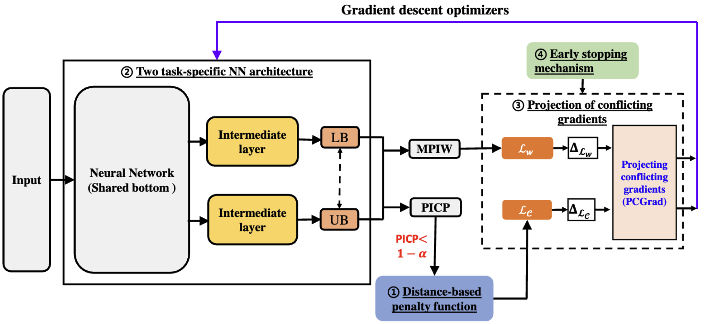

# Continuous Optimization for Construction of Neural Network-Based Prediction Intervals

The official implementation of the paper ["Continuous Optimization for Construction of Neural Network-Based Prediction Intervals"].


&nbsp;


## Requirements
* numpy==1.24.3
* openpyxl==3.1.2
* matplotlib==3.0.3
* ensorflow-macos==2.13.0
* tensorflow-metal==1.1.0
* keras==2.13.1
* xlrd==2.0.1
* tqdm==4.66.1

To install requirements:

```setup
pip install -r requirements.txt
```


